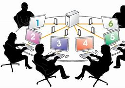

## Lab : How multiple users can access a unique instance remotly and share content.

### The goal for this Lab is to prepare a working area for Devops Teams .
# I - Provision an instance using either with Python script or Terraform 
     - 
     - 
# II - Create users for our new teams.
       - Use for loop, or some other methods to create multiple users at once.
# III - Create a strong password for users .
# IV  - Create groups : Devops and Admin . Assign Devops engineer to Devops group aand Ssytem admin to Admin group 
# V - Create the vorking directory for Devops teams so they can store and share common files.
# VI - Give read/write permission to the directory so all teams members can edit and view.
# VII - Configure instance  so teams menbers can remotly ssh it.
# VIII -System admin will review if all members get acces to the instance.
